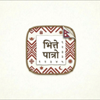

# Bhitte Patro

  

  <strong>Bhitte Patro</strong> is a lightweight Nepali calendar menu bar application for macOS. It provides quick access to the current Bikram Sambat date, a full month view, and essential calendar information directly from your menu bar.

---

  
   
  <em>Main Application Interface</em>

  
   
  <em>Discreet Menu Bar Integration</em>

---

## About Bhitte Patro

Bhitte Patro (Nepali: भित्ते पात्रो, meaning "Wall Calendar") is designed for those who need instant access to the Nepali calendar (Bikram Sambat) without the need for bulky applications or web searches. It sits perfectly in your macOS menu bar, staying out of your way until you need it.

### Core Features

- **Menu Bar Integration:** Access the calendar instantly with a single click.
- **Bikram Sambat Date:** View the current date in the BS system at a glance.
- **Full Month View:** A clean and simple layout showing the entire month's dates.
- **Minimalist Design:** Fast, lightweight, and native to macOS.

### Roadmap

- [ ] **Upcoming Holidays:** Integration of major Nepali holidays and public breaks.
- [ ] **Custom Reminders:** Set notifications for special days and personal events.
- [ ] **Date Conversion:** Built-in tool for AD to BS and BS to AD conversion.
- [ ] **Time-zone Support:** Quick conversion for various time zones.

## Installation

1. Download the latest release.
2. Drag **Bhitte Patro** to your Applications folder.
3. Open the app to see the icon in your menu bar.

## License

This project is licensed under the MIT License.
